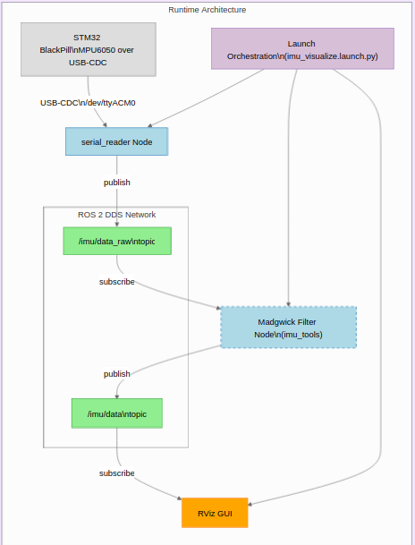
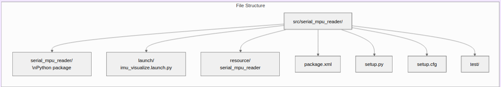
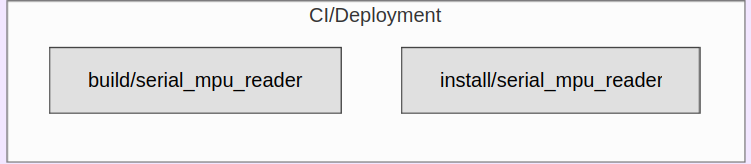

# BlackPillCDC_RvizVisualization
ROS2 Humble package to parse and visualize IMU data from an STM32 and MPU6050 sensor streamed via USB CDC serial. 

To run, navigate to the BlackPillCDC_RvizVisualization directory and <source install/setup.zsh> or <source install/setup.bash> depending on the shell you're using. Then use `ros2 launch serial_mpu_reader imu_visualize.launch.py` to launch everything.

This launches one ros node that reads from /dev/ttyACM0 (serial USB input) and publishes on /imu/data_raw. It also launches a madgwick filter from imu_tools (https://github.com/CCNYRoboticsLab/imu_tools) that subscribes to /imu/data_raw and publishes to /imu/data. It also opens an RViz window. Then go to File->Open config and click on rvizconfig.rviz. Now the IMU model should show up on your screen and move according to your IMU.

All diagrams were generated using [gitdiagram](https://gitdiagram.com/Sohail103/BlackPillCDC_RvizVisualization)

[Watch demo video](demo.mp4)
